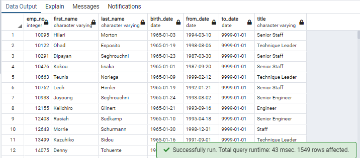

# Pewlett-Hackard-Analysis

## Overview of the analysis

This analysis is created to provide necessary data for Pewlett-Hackard company to prepare for upcoming retiring of large amount of employees and make sure that new employees who is going to fill those vacancies can get a good training. Necessary data includes the number of retiring employees per title, and identifying employees who are eligible to participate in a mentorship program.

## Results

1. Retirement Titles table holds all the titles of employees who were born between January 1, 1952 and December 31, 1955. 

   

   There are 133776 rows but there are duplicate entries for some employees because they have switched titles over the years.

2. Using the `DISTINCT ON` statement I created a table that contains the most recent title of each employee.

   

   So now we got 72458 employees and their titles who currently work in  Pewlett-Hackard and about to retire.

3. Then, using the `COUNT()` function created a table that has the number of retirement-age employees by most recent job title.

   

4. Created a mentorship-eligibility table that holds the current employees who were born between January 1, 1965 and December 31, 1965.

So we got 1549 mentors.

## Summary

- <u>How many roles will need to be filled as the "silver tsunami" begins to make an impact?</u>

  72458 vacancies is going be open in nearest future.

- <u>Are there enough qualified, retirement-ready employees in the departments to mentor the next generation of Pewlett Hackard employees?</u>

  If we divide 72458 vacancies between 1549 mentors born in 1965 then we got 46-47 interns per mentor which is pretty much (not even considering that there will be needed different amount of new employees in different positions). But if we split those 72458 vacancies for four years (to cover all the retirees born in 1952-1955) then we got 11-12 interns per mentor which is about 1 intern a month for a year which is  more feasible plan.

**Provide two additional queries or tables that may provide more insight into the upcoming "silver tsunami."**

1. We can get amount of mentors for every job title:

   

   to know better how many interns will get every mentor and if there are more mentors needed.

2. We also can refactor the code to choose mentors born in 1952 as they are going to retire first.

   

So we got 18537 potential mentors.